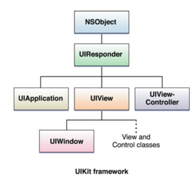

### TextInput
### UITextField
### UITextView
### TextInput Delegates
### Customizing TextInput Views
### UIWebView/WKWebView
### Custom Drawing With Core Graphics & UIBezierPath

# Text Input
* UIKit offers 2 ways to input text
1\. UITextField: single lines
2\. UITextView: multiple lines

* UITextView inherits from UIScrollView
* Delegates are important for interacting with text input controls
* These inputs conform to the UITextInputTraits protocol which allows you to customize the keyboard type

# UIResponder

* Both UITextField & UITextView inherit from UIResponder
* Let’s talk about responders in iOS.
* All responder objects inherit from the class UIResponder
* Any instance that inherits from UIResponder can handle events, like, touch events, motion events, presses (from accessories).
* Visible elements of an app are almost always responders. e.g. all subclasses of UIViews, controls (like UIButton).
* ViewControllers, the UIApplication are responders.
* The AppDelegate is a also a subclass of UIResponder.

# Responder Chain
* If a responder cannot handle an event it _automatically_  forwards it to the "next responder" in a linked series called the **responder chain**.

* The Responder Chain will always mark one responder as the First Responder and one as the Next Responder.
* The responder chain allows flexibility in handling events. (How so?).
* Events travel up the chain starting at the leaf most responder.
* If nothing overrides the event in question it is forwarded to the next responder in the chain until the final responder in the chain the UIApplication (unless we override UIApplication (don't)).
* If UIApplication delegate doesn't handle it then the event is just discarded.
* _userInteractionEnabled_ is a property on UIView that determines whether a view receives interactions. By default this is set to YES for UIViews. 
* But most subclasses of UIView (like UIImageView, UILabel, etc.) set _userInteractionEnabled_ to NO by default. 
* So, if you want a UIImageView to handle a touch event you must always set the _userInteractionEnabled_ to YES. (This is a common beginner gotcha).

# UIWebView / WKWebView / SFSafariViewController

* UIWebView is a crippled version of Safari that you can just drop into your view controller.
* Apple says "In apps that run in iOS 8 and later, use the WKWebView class instead of using UIWebView." It is marked as deprecated in IB.
* WKWebView is much faster and more flexible and as of Xcode 9.0.1 it has IB support!
* You can use webviews for displaying web pages (obviously!)
* You can also load web content from other sources, like a data base, or network endpoint.
* You can interact with web content using javascript and do things like make content editable using _contentEditable_. So, you can make a blog editor from a webview, for instance.
* SFSafariViewController "includes Safari features such as Reader, AutoFill, Fraudulent Website Detection, and content blocking. It shares cookies and other website data with Safari".
* "If your app lets users view websites from anywhere on the Internet, use the SFSafariViewController class. If your app customizes, interacts with, or controls the display of web content, use the WKWebView class."
* Many apps now use SFSafariViewController, for instance Tweetbot.
