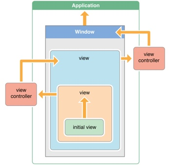

###TextInput
###UITextField
###UITextView
###TextInput Delegates
###Customizing TextInput Views
###UIWebView/WKWebView
###Custom Drawing With Core Graphics & UIBezierPath

#Text Input
* UIKit offers 2 ways to input text
1\. UITextField: single lines
2\. UITextView: multiple lines

* UITextView inherits from UIScrollView
* Delegates are important for interacting with text input controls
* These inputs conform to the UITextInputTraits protocol which allows you to customize the keyboard type

#UIResponder
* Both UITextField & UITextView inherit from UIResponder
* Let’s talk about responders in iOS.
* All responder objects inherit from the class UIResponder
* Any instance that inherits from UIResponder can handle events, like, touch events, motion events, etc.
* Visible elements of an app are almost always responders. e.g. all subclasses of UIViews, controls (like UIButton)
* ViewControllers, the UIApplication are responders.
* The AppDelegate is a also a subclass of UIResponder.

# Responder Chain
* If a responder cannot handle an event it _automatically_  forwards it to the "next responder" in a linked series called the **responder chain**.

* The Responder Chain will always mark one responder as the First Responder and one as the Next Responder.
* The responder chain allows flexibility in handling events. (How so?).
* Events travel up the chain starting at the leaf most responder.
* If nothing overrides the event in question it is forwarded to the next responder in the chain until the final responder in the chain the UIApplication (unless we override UIApplication (don't) this isn't relevant, but we can get any UIResponder events in the AppDelegate).
* If UIApplication delegate doesn't handle it then the event is just discarded.
* _userInteractionEnabled_ is a property on UIView that determines whether a view receives interactions. By default this is set to YES for UIView's but most subclasses (like UIImageView, UILabel, etc.) set this to NO by default. So, if you want a UIImageView to handle a touch event you must always set the _userInteractionEnabled_ to YES. (This is a common beginner gotcha).

# UIWebView / WKWebView / SFSafariViewController

* UIWebView is basically a slightly crippled version of Safari that you can just drop into your view controller.
* UIWebView has been replaced by WKWebView, which is much faster and more flexible, but it has no representation in IB (so you create them programmatically).
* You can use webviews for displaying web pages (obviously!)
* You can also load web content from other sources, like a data base, or network endpoint.
* You can interact with web content using javascript and do things like make content editable using _contentEditable_. So, you can make a blog editor from a webview, for instance.
* SFSafariViewController "includes Safari features such as Reader, AutoFill, Fraudulent Website Detection, and content blocking. It shares cookies and other website data with Safari".
* "If your app lets users view websites from anywhere on the Internet, use the SFSafariViewController class. If your app customizes, interacts with, or controls the display of web content, use the WKWebView class."
